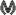

# Mossism:

An Open Source Quake-esque FPS Made In The Godot Engine

		 

## Gameplay:

Movement and the capability of dying.

	

## To Do:

- [ ] Controller support
- [ ] Functioning health system
- [x] Bouncy bullets {partial}
- [ ] Add items
	- [ ] Add more weapons
	- [ ] Ranged weapons
		- [x] Bouncy bullet sawed-off
		- [ ] 4 dimensional flame thrower like thing
		- [ ] Electro-gun (It will shock you!)
		- [ ] Boomarang like gun
		- [ ] Mind control fungus gun
		- [ ] Fungicide spray
		- [ ] Acid kunai (leaves a trail of acid behind when thrown)
		- [ ] Babydoll bazooka
		- [ ] Ectoplasm waterballoon launcher
		- [ ] Psychic spoon
	- [ ] Melee weapons
		- [ ] Aloe frond
		- [ ] Crowbar
		- [ ] Axe
		- [ ] Vine whip
	- [ ] Mossling weapons {may or may not be usable by player, have yet to decide}
	- [ ] Defense Orbiter(s) (Temporary defense orb item)
		- [ ] Light
		- [ ] Electric
		- [ ] Fire
		- [ ] Water (Only usable by monsters)
	- [ ] Weird/Miscellaneous
		- [ ] Landmine which is a carpet (Carpet bomb)
		- [ ] Egg dropper (drops rotten eggs which can distract enemies)
		- [ ] Bottle pop (one time use cork launch)
		- [ ] Chainsaw
		- [ ] Resizeable (the chainsaw can change length at the users will, but gets slower the longer it is, oh and it still colides with walls)
		- [ ] Rocket powered (can be thrown, but needs to be picked up after thrown)
- [ ] Enemies
	- [ ] Mossling
	- [ ] Moss Mage
	- [ ] Mossy Fiend
	- [ ] Moss Arbiter
- [ ] VFX
	- [ ] Moss roots follow behind the enemies
- [ ] Enemy health system
- [ ] Enemy damage
- [ ] Player damage
- [ ] Split screen/multiplayer support
- [x] Single screen/solo support {re-implemented. partial}
- [ ] Tutorial map
- [x] Story maps {partial}
- [ ] Multiplayer gamemodes (for people who have friend... unlike you) {not final}
	- [ ] Moss or die (kind of like 3V3)
	- [ ] Capture the obelisk (like capture the flag)
	- [ ] You're not my friend (savior mode but with your friends... but not actually)
- [ ] Single player gamemodes (for those who are all alone) {not final}
	- [ ] Savior (normal single player campaign)
	- [ ] Already (for kids and grandmas)
	- [ ] Maybe (for noobs)
	- [ ] Probably not... (for most people)
	- [ ] Not a chance... (for GAMERS)
	- [ ] Feeling Mossy? (for those who are all alone... and hate society) (like saviour but the opposite)
	- [ ] Too late... (for GAMERS)
	- [ ] It's possible (for most people)
	- [ ] Maybe (for noobs)
	- [ ] Done early (for kids and grandmas)
- [x] Menus (partial)
- [ ] Everything else...

## Contributing:

- ## For Developers:
	
	- Fork The Project
	- Implement any features you want in the game by using the Godot Engine
	- Create a pull request for any features you add, and think would improve the game I'll add them to this repository if they are suitable and not very buggy

- ## For Non-Developers:
	
	- Create a discussion asking for the feature you want, and why you think it would improve the game, along with providing any implications it may have
	- Report any bugs you run into if they don't already have issues

## FAQ:

- Q: Why are the textures provided in the source?
	- A: Because they're mostly done and I would like to provide them.
- Q: Will there be more textures/maps?
	- A: Yes. Give it time.
- Q: Why are there insults/snarky comments in the readme?
	- A: To be a little reminiscent of Quake's manual and menus...

## Credits:

- [Godot-Jolt](https://github.com/godot-jolt/godot-jolt) [Various (mostly mihe)](https://github.com/godot-jolt/godot-jolt/graphs/contributors)
- [Qodot](https://github.com/QodotPlugin/Qodot) [Various](https://github.com/QodotPlugin/Qodot/graphs/contributors)

## License:

The majority of the code in this repository is under the ZLib license.
However the contents of directories under the [addons](/addons) directory are under various licenses depending on the project.
- Godot-Jolt license
	- [Main repository](https://github.com/godot-jolt/godot-jolt/blob/master/LICENSE.txt)
	- [Local](/addons/godot-jolt/LICENSE.txt)
- Qodot license
	- [Main repository](https://raw.githubusercontent.com/QodotPlugin/Qodot/main/LICENSE)
	- [Local](/addons/qodot/LICENSE)
